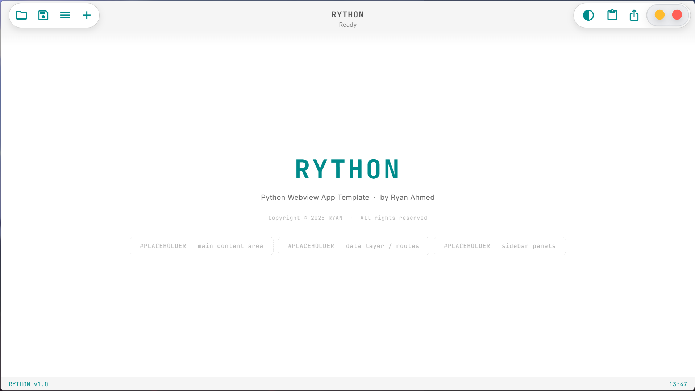
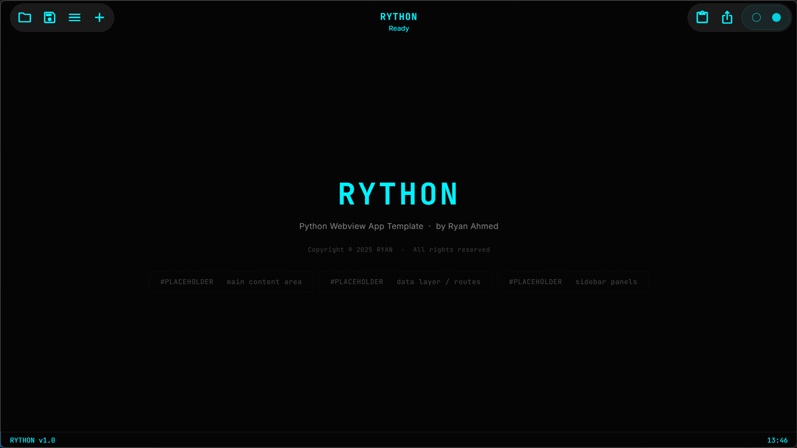
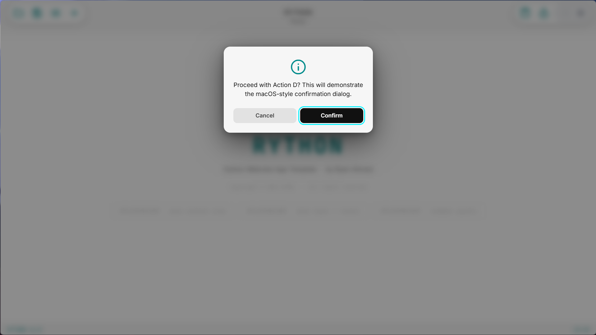

# RYTHON

> **A frameless Python desktop app template** — Flask backend · pywebview shell · WinAPI window control · zero Electron.

&nbsp;

## Screenshots

| Light Mode | Dark Mode |
|:---:|:---:|
|  |
|:---:|
|  |
&nbsp;
| Confirmation Dialog |
|:---:|
|  |

&nbsp;

---

## What is Rython?

Rython is a **single-file fullstack desktop app template** written in Python. It lets you build a native-feeling Windows desktop application using nothing but a Flask server, a pywebview shell, and a hand-rolled WinAPI layer — no Electron, no Node.js, no browser chrome.

The entire UI lives in HTML/CSS/JS served locally by Flask on `127.0.0.1:5000`. The window itself is a chromium webview with `frameless=True`, dressed up with a custom title bar, resize handles, snap shortcuts, collapsible sidebars, a macOS-style dialog system, and a persistent dark/light theme — all implemented without a single native UI framework.

---

## The Frameless Window Problem — and How Rython Solves It

Frameless windows in pywebview have a well-known limitation: removing the OS frame also strips the native **resize hit-testing**, **drag behaviour**, and **snap-to-edge** support that Windows provides for free on decorated windows. Most projects either live with this (no resizing) or bolt on a heavy workaround that breaks on multi-monitor setups or high-DPI displays.

Rython solves this with a lean, direct WinAPI approach:

- **Resize handles** — 8 px invisible CSS strips at every edge and corner. On `mousedown` they call `window.pywebview.api.start_drag(mode)`, which issues a `SendMessage(hwnd, WM_NCLBUTTONDOWN, HT_*)` hit-test directly into the window message queue. Windows then handles the resize natively — no JS polling, no coordinate math, no jitter.
- **Title-bar drag** — a daemon thread polls `GetAsyncKeyState` at 5 ms intervals and calls `SetWindowPos` in a tight loop only while the left mouse button is held. This keeps the UI thread completely free and produces smooth, lag-free drag.
- **Snap shortcuts** — `Alt+←`, `Alt+→`, `Alt+↑`, `Alt+↓` call `snap_window()`, which queries the correct monitor's work area via `MonitorFromPoint` / `GetMonitorInfoW` and clamps the window to the target bounds — correctly handling taskbars, multi-monitor layouts, and different DPI scales.
- **HWND cache** — the window handle is resolved once via `FindWindowW` and cached, so every subsequent WinAPI call is a direct pointer dereference with no search overhead.
- **Style preservation** — the original `WS_*` style flags are saved at startup and restored before any `SetWindowPos` call, preventing the invisible-border artefact that appears when pywebview's internal style patching conflicts with a resize operation.

The net result is a frameless window that behaves identically to a native one: resizable from all edges and corners, draggable, snappable, maximisable, and correctly clipped to the monitor work area — without any visible frame, title bar chrome, or OS decoration.

---

## Features

**Window & chrome**
- Frameless window with fully custom title bar
- Resize from all 8 edges and corners via WinAPI hit-testing
- Title-bar drag via daemon-thread `SetWindowPos` loop
- Snap: `Alt+←` left-half · `Alt+→` right-half · `Alt+↓` centred · `Alt+↑` maximise ↔ restore
- Double-click title bar to maximise / restore
- Traffic-light close and minimise buttons

**Navigation**
- Left pill: 4 fixed + 3 hover-revealed icon buttons
- Right pill: 3 hover (including theme toggle) + 3 fixed + traffic lights
- Collapsible sidebars via `ArrowLeft` / `ArrowRight`
- Sidebar borders fade seamlessly into the title bar
- Centre title pill: app name + rolling status line

**UX**
- Unibar command overlay — `Alt+S` or double-click title → `//commands`
- macOS-style modal dialogs: `showDialog(msg, icon?)` and `showInputDialog(msg, default?)`
- Dark / light theme persisted to `localStorage`
- SQLite ready — commented scaffold for `get_conn()`, `init_db()`, and full CRUD routes
- `WindowApi` class exposes OS-level methods to JS: file/folder dialogs, window control, extensible

**Developer ergonomics**
- Single `.py` file — no build step, no bundler, no config files to wrangle
- Inline HTML/CSS/JS — everything in one place during prototyping; split to `static/` and `templates/` when scaling
- Commented project layout guide for growing beyond one file
- PyInstaller packaging to a single `.exe` with one command
- Zero required dependencies beyond `flask` and `pywebview`

---

## Quickstart

```bash
pip install -r requirements.txt
python rython.py
```

To package to a standalone executable:

```bash
pip install pyinstaller
pyinstaller --noconsole --onefile --name RYTHON rython.py
```

---

## Project Layout (when scaling up)

```
rython/
├── app.py              ← Flask backend (keep lean)
├── database.py         ← DB init, get_conn(), migrations
├── models.py           ← Pure-Python data classes / business logic
├── routes/
│   ├── __init__.py
│   └── items.py        ← @items_bp.route('/api/items', ...)
├── static/
│   ├── app.js
│   ├── style.css
│   └── icons/
├── templates/
│   └── index.html
├── rython.db           ← auto-created; add to .gitignore
├── .env                ← secrets — NEVER commit
├── .gitignore
└── requirements.txt
```

---

*Built by Ryan Ahmed*
